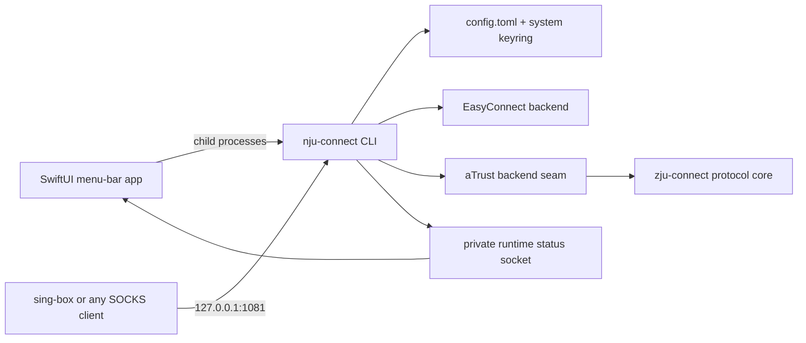
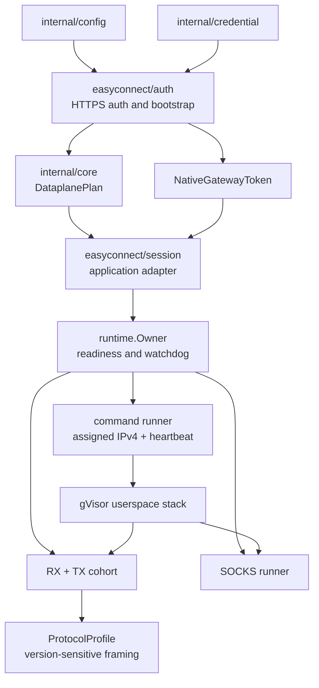

# nju-connect architecture

nju-connect is a campus VPN client with two parts: a Go CLI that owns every
protocol, secret and runtime, and a SwiftUI menu-bar app that drives the CLI.
It supports two mutually exclusive backends: EasyConnect (nju-connect's own
implementation) and aTrust (through the pinned AGPL-3.0
`mythologyli/zju-connect` client). Traffic leaves through one numeric loopback
SOCKS5 listener (`127.0.0.1:1081` by default). nju-connect never creates a
kernel TUN, installs routes, changes DNS or PF, or starts a vendor service.

The observable CLI surface (commands, exit codes, JSON, the app's command
lines) is specified in [`cli-contract.md`](cli-contract.md).



## Ownership

| Layer | Owns | Must not own |
| --- | --- | --- |
| `cmd/nju-connect` | Cobra commands, output formatting, exit codes | business logic |
| `internal/app` | setup, account, connect lifecycle, background handoff, speed test; every dependency injected through `app.Deps` | terminal rendering |
| `internal/tui` | huh forms on a terminal, line prompts otherwise | protocol state |
| `internal/config` | backend, gateway, authentication selection, loopback listener | cookies, OAuth browser state, passwords |
| `internal/credential` | the system keyring (go-keyring) or owner-only files | anything but opaque secret bytes |
| `internal/backend` | backend vocabulary, catalog, endpoints, discovery and session contracts | UI state, keyring access |
| `internal/backend/easyconnect` | EasyConnect authentication and native session handoff | aTrust resources |
| `internal/backend/atrust` | `Core`/`Session`/`Tunnel`/`Prompter`, the zju-connect adapter, resource model, SOCKS routing, OAuth callback validation | EasyConnect tokens |
| `internal/runtime`, `internal/core` | the EasyConnect userspace dataplane | configuration, credentials |
| `internal/runtimecontrol` | the status/disconnect socket | runtime state (it only reports it) |
| `NJUConnectUI` (Swift) | backend selection and sanitized presentation | passwords, protocol requests, sockets |
| `ATrustOAuthHelper` (Swift) | an isolated WebKit profile for browser login; returns only the authorization code | aTrust session state, passwords |

The Go core never depends on Swift. CI checks the core and the Swift shell in
separate jobs.

## The macOS app

The app runs the bundled CLI (`Contents/Helpers/nju-connect`) as child
processes and parses only the strong-contract output.

1. The user picks Off, EasyConnect or aTrust. The app stops an active runtime
   first, then runs `configure --backend <name>`, which writes only
   non-secret settings and refuses while a runtime is live.
2. It starts `connect --verification-code-stdin`. EasyConnect adds
   `--background` and hands off to the detached runtime; aTrust runs as a
   foreground child whose lifetime is the session.
3. It reads `status --json`, and `status --json --watch` while the panel is
   open. The status `profile` (`community-utls` or `atrust-tcp`) names the
   backend that owns the runtime; on launch the app adopts it.

Switching backends never mutates a live session: stop, replace and start is
the boundary, which lets both backends share the one SOCKS listener.

Secrets reach the CLI only through a child pipe: `setup --password-stdin` for
the password, and the running `connect` process's stdin for one-time codes.
The Swift layer never puts them in arguments, environment variables or logs.
Gateway defaults and authentication capabilities come from
`backends --json`, not from Swift constants.

## EasyConnect runtime



`runtime.NativeSession` owns the token copy, the channel-backed gVisor stack,
the stream cohort, the SOCKS listener and their shutdown. `ProtocolProfile`
owns only version-sensitive command and data framing.

`runtime.Owner` is the single state authority. Its readiness set is exactly
command, RX, TX and SOCKS:

```text
all four ready                                 -> connected
any component drops after connected            -> reconnecting
initial or partial readiness                   -> connecting
reconnecting without recovery before watchdog  -> renewal_required
```

RX and TX are one failure domain: the first worker failure cancels the
generation, closes both streams and waits for both before the next generation
opens. The observer is a sanitized, serialized projection of this state; it
never exports gateway addresses, cookies, tokens, wire bytes or raw errors.

### Background runtime

`connect --background` authenticates in the foreground, then re-executes the
binary as the hidden `_native-runtime` command. Only the configuration, the
dataplane plan, the 48-byte `NativeGatewayToken` and the profile cross an
inherited pipe; nothing goes into argv, the environment or a file, and both
sides clear the token. The child reports readiness on a second pipe before the
parent returns, and appends sanitized output to the owner-only `runtime.log`.
The wire details are in the contract document.

Background hosting is Unix-only and EasyConnect-only for now.

## aTrust backend

`NewCore` adapts the upstream `client/atrust` package to `Core`:

- `Discover` calls the public `authConfig` discovery through
  `Endpoint.DialHost()`. `backend.ATrustEndpoint` keeps `vpn.nju.edu.cn` as
  the TLS and OAuth identity while dialing `219.219.118.20`, because public
  DNS still resolves the name to the EasyConnect appliance. Profiles naming
  the retired `ztna.nju.edu.cn` are redirected.
- `Authenticate` collects the password or OAuth code through the `Prompter`
  before calling upstream `Setup`. The upstream client reads later factors
  (SMS code, captcha) with `fmt.Scanln` after logging a prompt, so the adapter
  installs a scoped bridge that swaps `os.Stdin` for a pipe, watches the
  upstream log lines and answers each prompt through the `Prompter`. The bridge
  also recognizes a rejected password (`Code: N` after
  `/passport/v1/auth/psw`). Upstream logins are serialized because the bridge
  is process-wide.
- The standard logger belongs to the adapter from `NewCore` on (`upstreamLog`),
  because the upstream client also logs during discovery and for the whole
  session. Its lines never reach the terminal; the host may route them to a
  debug sink with `SetUpstreamDebugLog` (the CLI does so for
  `NJU_CONNECT_DEBUG=1`).
- `Resume` runs `Setup` with the saved client data and refuses every prompt;
  any non-network rejection is `ErrSessionExpired`.
- `Session.Resources` translates upstream IP, domain and DNS resources, and
  `Tunnel.DialTCP` passes the original SOCKS domain to the node.

The saved client data is opaque outside the core and lives in its own keyring
item. The OAuth helper keeps a separate WebKit profile.

Known gaps, inherited from the upstream client: it dials with its own dialer
(a configured upstream proxy is ignored), does not verify gateway or node
certificates, and has no gateway-side logout. Background hosting, graphical
captcha, UDP/L3 and IPv6 resources are not implemented.

## Campus speed test

`speedtest` runs a pinned LibreSpeed helper against only `speed.nju.edu.cn`
over IPv4. It probes the direct path first and falls back to the live
runtime's loopback SOCKS listener only when the direct probe fails. The helper
ignores ambient proxy variables, disables telemetry and sharing, and is a
separately executed LGPL component: on macOS the
`librespeed-cli-soundconnect` Homebrew Formula builds it from the source kept
in `soundadam/soundprobe`, and the app never embeds it.

## Platforms

| Capability | Linux | macOS | Windows |
| --- | --- | --- | --- |
| Build (`CGO_ENABLED=0`) | amd64, arm64 | amd64, arm64 | amd64, arm64 |
| Credentials | Secret Service, or `credential_store = "file"` | login Keychain | Credential Manager |
| Config ownership checks | `euid` + mode | `euid` + mode | not implemented; fails closed |
| Background runtime | yes | yes | no |
| App | — | menu-bar app | — |

On macOS go-keyring stores items through `/usr/bin/security`, so any process
running as the user can read the password without a Keychain prompt. The
trade-off buys one credential path on every OS and no re-prompt after a
rebuild. Pre-keyring Keychain items are imported once (a cgo build is needed
for that import only).

## Releases and dependencies

nju-connect is AGPL-3.0 because it links zju-connect; `sing-tun` and `sing`
are GPL-3.0-or-later. `THIRD_PARTY_NOTICES` indexes every linked module, and
a binary release must ship their license texts and the corresponding source.
Re-derive the linked set with `go list -deps ./cmd/nju-connect` for each OS
when imports change.

Before a release, from a clean worktree:

```sh
make check              # fmt-check, test, test-race, vet, leak-check
make build build-platforms
make release-check      # adds versioning tests and swift test
```

`make cli-release VERSION=vX.Y.Z` builds the darwin CLI archives with their
licenses and checksums. `make package-macos VERSION=X.Y.Z` builds the app
archive. Developer ID signing and notarization are not configured, so app
builds are ad-hoc signed.
