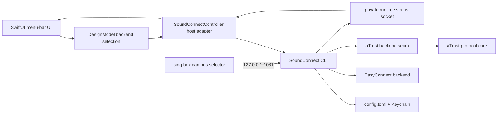

# GUI and backend switching architecture

This document defines the boundary for switching between EasyConnect and
aTrust without teaching the SwiftUI layer either protocol's wire format.

## Ownership

| Layer | Owns | Must not own |
| --- | --- | --- |
| `internal/config` | backend name, gateway, authentication selection, loopback listener | protocol cookies, OAuth browser state, passwords |
| `internal/backend` | backend vocabulary, presentation-safe catalog, endpoint mapping, discovery and session contracts | UI state and Keychain implementation |
| `internal/backend/easyconnect` | EasyConnect authentication and native session handoff | aTrust resources or SwiftUI state |
| `internal/backend/atrust` | `Core`/`Session`/`Tunnel`/`Prompter` interfaces, the zju-connect protocol adapter, resource model, SOCKS routing, lifecycle, OAuth callback validation | EasyConnect tokens, UI controls |
| `cmd/soundconnect` | lifecycle, config selection, Keychain access, interactive prompts, status publication | SwiftUI layout |
| `SoundConnectUI` | user-facing backend selection and sanitized presentation | passwords, protocol requests, tunnel sockets |
| `ATrustOAuthHelper` | isolated WebKit profile for browser login; returns only the authorization code | aTrust session state, passwords |
| `integrations/sing-box` | external traffic-selection fragment | starting or authenticating SoundConnect |

## Switching transaction

1. The user picks Off, EasyConnect, or aTrust in `BackendSwitch`; the CLI
   configuration owns the one shared SOCKS listener setting.
2. `DesignModel` stops an active runtime before applying the new selection.
3. `SoundConnectController` runs `soundconnect configure --backend <name>`,
   which writes only non-secret config and refuses while a runtime is live.
   The CLI owns Keychain access and authentication.
4. The controller starts `soundconnect connect`. EasyConnect hands off to the
   detached background runtime; aTrust, which has no background mode yet,
   runs as a foreground child whose lifetime is the session.
5. The controller reads the sanitized runtime status (`status --json`, and
   `--watch` while the panel is open). The status `profile` identifies the
   backend that owns the runtime (`community-utls` or `atrust-tcp`).
6. sing-box continues using the same `127.0.0.1:1081` outbound for either
   backend.

Changing a backend while connected must never mutate a live protocol session
in place. Stop, replace, and start is the safe boundary; it lets both mutually
exclusive backends reuse the one configured loopback port. On launch the model
adopts whichever backend the running runtime reports.

## Secrets and prompts

The setup form uses `setup --backend <name> --password-stdin` only through the
local child pipe; the CLI writes the password to the shared Keychain item and
the Swift layer does not put it in arguments, environment variables, or logs.
Gateway defaults and authentication capabilities come from
`soundconnect backends --json`; aTrust authentication types and tenant login
domains are owned or discovered by Go rather than hard-coded in Swift.

One-time verification codes travel through the running `connect` process's
stdin (`--verification-code-stdin`). For aTrust, the CLI implements the seam's
`Prompter`: the Keychain password, the verification-code pipe, and the OAuth
helper (or a pasted callback URL when the helper is absent). The protocol core
never reads the terminal: upstream standard-input prompts are bridged to the
`Prompter`. aTrust client data is opaque to everything outside
the core and is stored in its own Keychain item.

## Current slice

Selecting aTrust runs the zju-connect-backed protocol core in the foreground
(see `docs/atrust-dual-backend.md`). The design-preview build keeps simulated
state so layout review does not start a real VPN process.

## Release gates

- Keep one CLI-owned SOCKS listener setting, defaulting to 1081 for both
  backends; the Swift host must not encode its own port default.
- Preserve the separate aTrust OAuth WebKit profile and Keychain client data.
- Surface a stopped/degraded status before changing the sing-box selector.
- Do not call a backend switch successful until the runtime status reports the
  selected profile and loopback listener.
- Sign the OAuth helper with the app and complete an attended callback
  acceptance test once the protocol core exists.
