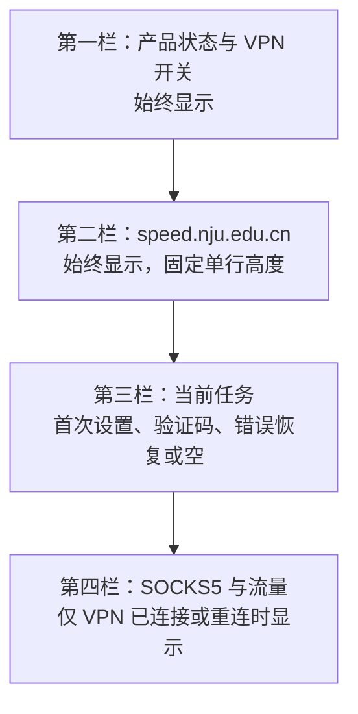
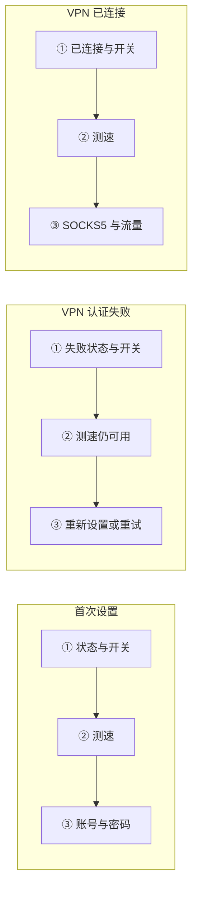
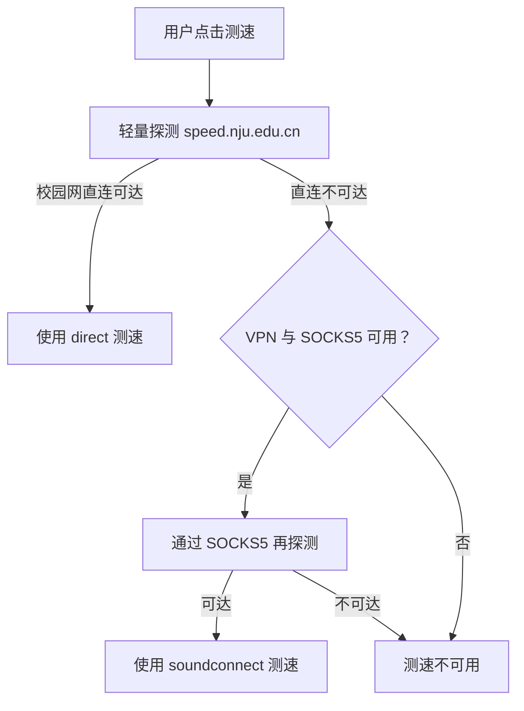
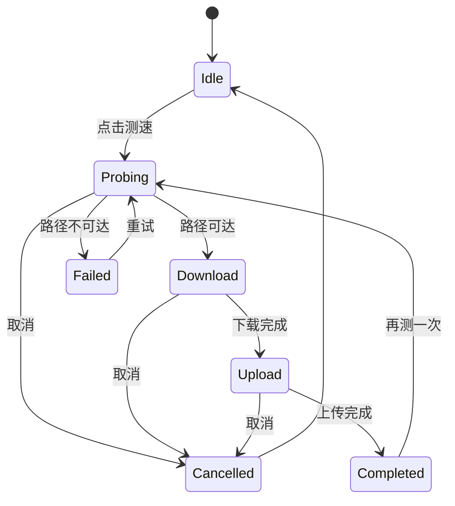

# soundconnect macOS UI（第一阶段）

这一版开始开发 `soundconnect` 的菜单栏面板结构：

- 顶部状态、服务开关和菜单栏图标
- 首次设置（学校账号、VPN 长期密码）
- 短信/动态口令输入
- VPN 数据通道与固定校内站点探测状态
- SOCKS5 地址、实时速率和本次累计流量
- 重连、账号失败和传输失败的恢复入口

当前 VPN 生命周期仍由 `DesignModel` 模拟；校园连通探测与测速通过本地
`soundconnect` CLI 执行。这样可以先确认布局、文案和状态层级，再接入真实 VPN
生命周期，避免把设计讨论和协议/服务控制问题混在一起。

## 面板槽位拓扑

面板使用固定顺序的槽位，而不是按状态把测速栏插入不同位置。测速与 VPN
认证是两个独立状态机：即使 VPN 认证失败，只要设备位于校园网、能够直连
`speed.nju.edu.cn`，仍然可以测速。



几个主要页面只替换槽位内容，不改变测速栏的位置：



设计约束：

- 第二栏始终存在，包括首次设置、服务离线、认证失败和传输失败。
- 第二栏固定为单行、固定高度；测速进度、结果和错误不能把面板撑高。
- 第三、第四栏可以在第二栏下方出现或消失，因此不会带动测速栏上下移动。
- SOCKS5 地址只在流量栏展示；测速路径不再占用单独一栏。

## 测速与 VPN 的依赖关系

`--route auto` 当前会先探测校园网直连。直连成功时不依赖 soundconnect；只有
直连失败后才检查 VPN 与本机 SOCKS5。因此“VPN 认证失败”和“校园测速不可用”
不能使用同一个状态或图标表达。



测速栏左侧图标只代表 `speed.nju.edu.cn` 的轻量连通与延迟状态，不代表 VPN
认证状态。当前会在面板模型启动时通过本地 CLI 执行一次无正文请求；后续可以在
网络变化或缓存到期时刷新，避免持续测速：

| 图标状态 | 判定 | 单行显示 | 详细信息位置 |
| --- | --- | --- | --- |
| 灰色未知 | 尚未探测或结果已过期 | `speed.nju.edu.cn` | 悬停提示“尚未检测” |
| 小型转轮 | 正在做轻量探测 | `speed.nju.edu.cn` | 不新增文字行 |
| 绿色通过 | 目标可达且延迟正常 | `speed.nju.edu.cn` | 悬停显示直连/VPN 路径和延迟 |
| 黄色警告 | 目标可达但延迟偏高 | `speed.nju.edu.cn` | 悬停显示延迟 |
| 红色失败 | 两条可用路径均失败 | `speed.nju.edu.cn` | 悬停显示简短错误 |

当前先以 200 ms 作为保守的黄色高延迟阈值；后续应根据真实校园网与 VPN
样本校准，而不是把这个初始值视为协议标准。

## 单行测速交互

测速过程中只替换左侧图标和右侧固定宽度区域。使用小型不定进度转轮和阶段性
数值，不使用横向进度条、第二行说明或会改变面板宽度的长错误文案。



单行视觉文案建议如下；所有状态保持同一行高：

```text
[○] speed.nju.edu.cn                         [测速]
[◌] speed.nju.edu.cn                   探测中 [取消]
[↓] speed.nju.edu.cn               ↓ 53 Mbps [取消]
[↑] speed.nju.edu.cn               ↑ 12 Mbps [取消]
[✓] speed.nju.edu.cn          ↓53 ↑12 Mbps      [↻]
[!] speed.nju.edu.cn                         [重试]
```

右侧区域预留固定宽度，数值使用等宽数字和一位或整数精度。阶段名称、路径、延迟、
完整错误和组件安装大小放入悬停提示或点击后的详情弹层，不进入常驻面板布局。

交互上不对整个面板做状态切换动画，避免开关或恢复按钮在点击过程中移动。VPN
开关和 `Retry` / `Reset` 至少保留 32pt 高的稳定点击区；点击后先立即更新本地
状态并显示进行中反馈，后端结果随后校正状态，不要求用户通过连续点击确认操作。

## 在 macOS 上查看

```sh
make macos-preview
```

界面默认使用英文。中英文文案成对保留在 Swift 源码的 `uiText` 模板中，可用以下
命令预览简体中文，不需要改动或取消注释源码：

```sh
make macos-preview UI_LANGUAGE=zh-Hans
```

预览窗口顶部的 `Speed test` 选择器可固定展示待测速、探测、下载、上传、完成和
失败状态。启动时默认停在 `Idle`：测速栏显示最近三次轻量 HTTP 探测的中位延迟；
点击测速摘要栏可在侧面的 CampusSpeedInspector 中查看最近十个样本的折线、
最小值、中位数、最大值和当前路径。

真实菜单栏面板每次打开时会在缓存超过 10 秒后自动采集三个样本，样本间隔
400 ms。常驻的第二栏只显示 `speed.nju.edu.cn`、状态图标以及当前或最近一次结果，
不并排放置 Ping 和测速按钮。点击整栏后打开独立的侧向测速详情：上半部分显示路径、
延迟折线与刷新入口，下半部分显示完整测速控制、下载/上传实时值和最近的带宽波动图。
侧面弹层优先出现在右侧，空间不足时由 macOS 自动翻到左侧；Dashboard 始终保持
292pt 宽度和固定行槽位。测速完成后，带宽曲线样本与最近结果会保存在本机 UI 状态中，
重启应用后仍可恢复；客户端公网 IP 不会保存。

预览窗口顶部的“状态”菜单可以切换所有主要页面。默认不加编译条件时，运行的是菜单栏面板：

```sh
cd macos
swift run
```

## 建议的设计讨论顺序

先看“已连接”，确认主路径；再依次看“首次设置”“等待验证码”“重连中”和“传输失败”。每个状态优先讨论四件事：信息是否太密、用户下一步是否明确、诊断信息是否应该默认展示、按钮/开关是否符合 macOS 习惯。

后续第二阶段再把 `DesignModel` 换成真实的 soundconnect 控制适配层，并保留这里已经确认的视觉结构。

## Homebrew 预览包

仓库根目录的 `scripts/package_macos_release.zsh` 会生成包含菜单栏 App 和
通用架构 CLI 的 Cask ZIP。校园测速通过真实 CLI 执行；LibreSpeed helper 作为
独立第三方 Homebrew Formula 安装，不打入 App，也不由 App 下载。当前仍只允许
按“设计预览”发布：VPN 设置和服务控制使用
模拟状态，产物使用 ad-hoc 签名且未经过 Apple notarization。Cask 和 Release
说明必须保留这些边界，不能把可构建或可安装表述为生产可用。
